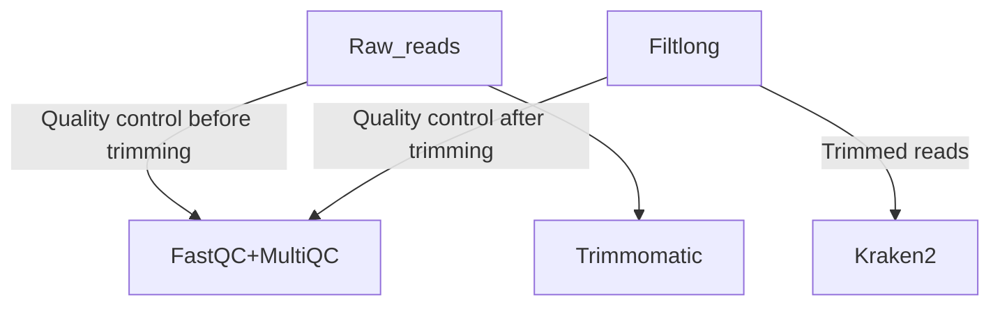

# THIMBLE

Throughput Holistic Inference from Metagenomic Biomarkers in Liquid Environments

Genomics pipeline for shotgun metagenomics ouput ; wastewater based

```mermaid
flowchart TD
    Raw_reads -- "Quality control before trimming" --> FastQC+MultiQC
    Raw_reads --> Trimmomatic

    Filtlong -- "Quality control after trimming" --> FastQC+MultiQC
    Filtlong -- "Trimmed reads" --> Kraken2
    
```
